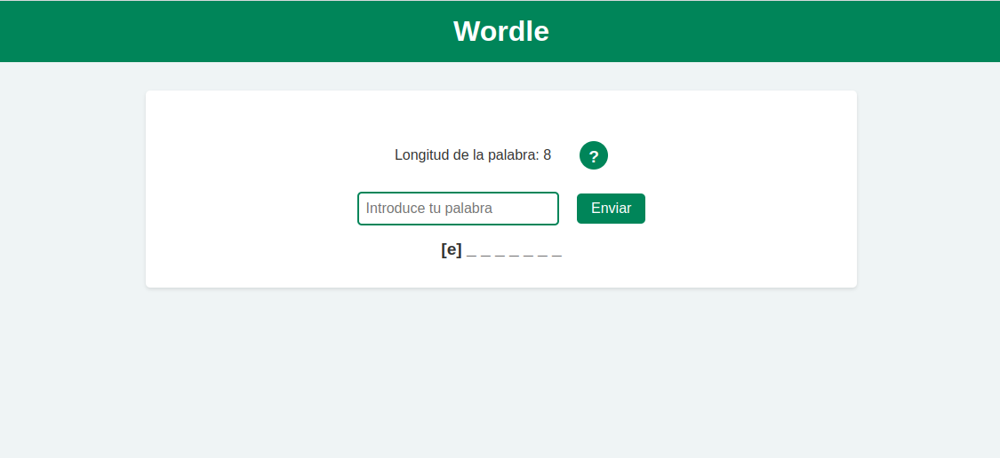

# Wordle

Wordle es un juego de adivinanza de palabras en el que los usuarios tienen que adivinar una palabra seleccionada al azar. El juego les muestra la longitud de la palabra y les da un número limitado de intentos para adivinar la palabra. Cada vez que hacen un intento, el juego les informa si alguna de las letras de su intento se encuentra en la palabra seleccionada, y si está en su posición se indicará con corchetes. Los usuarios pueden utilizar esta información para adivinar la palabra completa antes de agotar sus intentos.
Cómo funciona

## Cómo funciona

Wordle está construido con HTML, CSS y JavaScript. El objetivo es mostrar la capacidad del autor de crear una web estática sencilla con Javascript Vanila utilizando el DOM. 

El archivo index.html define la estructura de la página, mientras que wordle.css define los estilos CSS. El archivo wordle.js contiene la lógica del juego.

El juego comienza seleccionando una palabra aleatoria de una lista de palabras predefinidas. Los usuarios introducen sus intentos en un campo de entrada de texto, y el juego comprueba si su intento es igual a la palabra seleccionada. Si es así, el juego felicita al usuario y le muestra los fuegos artificiales. Si el usuario no adivina la palabra, el juego les da una pista sobre qué letras están en la palabra y en qué posición.

El juego también incluye una información emergente para explicar las reglas del juego a los usuarios, así como una sección de mensajes que proporciona retroalimentación al usuario sobre su progreso.

## Cómo jugar

Para jugar a Wordle, simplemente abre el proyecto en tu navegador web y sigue las instrucciones en la pantalla. Si quieres personalizar el juego, puedes modificar la lista de palabras en el archivo wordle.js para incluir tus propias palabras.

## Licencia 
Wordle está disponible bajo la Licencia MIT
